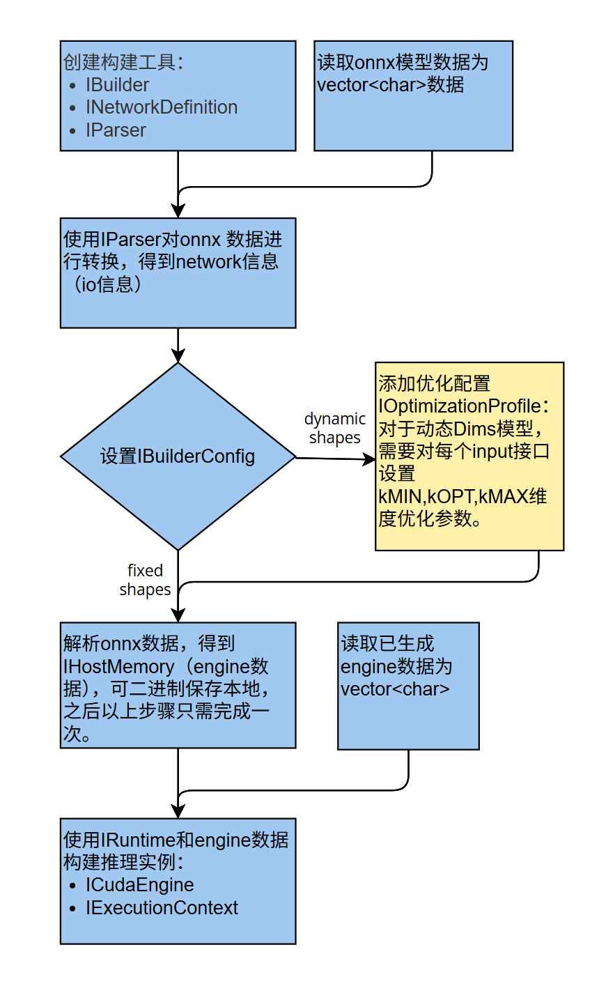
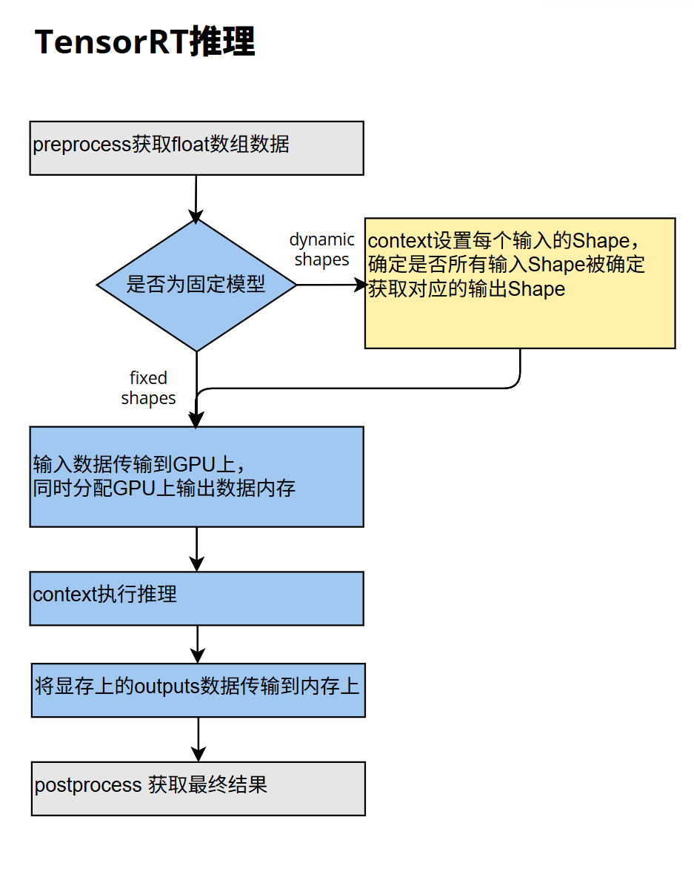

# tensorRT inference  
> 使用版本：cuda12.1  tensorRT10.3  cudnn8.9.7

## tensorRT推理流程

tensorRT 推理onnx模型分为两部
- 解析onnx模型，生成engine数据
- 加载engine数据，构建context，进行推理

### 一 解析onnx模型生成engine数据

 

code流程  
1. 创建构建工具  
``` c++  
NVlogger nvlogger;
auto builder = std::unique_ptr<nvinfer1::IBuilder>(nvinfer1::createInferBuilder(nvlogger));
auto network = std::unique_ptr<nvinfer1::INetworkDefinition>(builder->createNetworkV2(1U<<static_cast<uint32_t>(nvinfer1::NetworkDefinitionCreationFlag::kEXPLICIT_BATCH)));//默认配置
auto parser = std::unique_ptr<nvonnxparser::IParser>(nvonnxparser::createParser(*network, nvlogger));
```  
2. 读取onnx数据
``` c++
std::string onnxPath="/path to onnx model/";
std::ifstream infile(onnxPath, std::ios::binary|std::ios::in);
infile.seekg(0,infile.end);
size_t dataLen=infile.tellg();
infile.seekg(0,infile.beg);
std::vector<char> onnxData(dataLen);
infile.read(onnxData.data(), onnxData.size());
infile.close();
```  
3. 解析onnx输出生成network  
``` c++
bool isParsed = parser->parse(onnxBuffer.data(), onnxBuffer.size()); //是否解析成功
int inputNum=network->getNbInputs();
const auto inputNode=network->getInput(i); //for i in range(0, inputNum)
const auto inputName=inputNode->getName(); //获取当前节点名
Dims inputDims=inputNode->getDimensions(); //获取当前节点形状，如果是动态shape，则对应维度为-1
// output同理
```  
4. 设置 IBuilderConfig  
``` c++
auto config = std::unique_ptr<nvinfer1::IBuilderConfig>(builder->createBuilderConfig());
config->setMaxWorkspaceSize(1 << 30); //设置中间工作数据显存1GB，engine和context不占用这部分显存，仅用来做中间计算数据缓存。
``` 
若是动态shape，则设置优化参数:  
``` c++
nvinfer1::IOptimizationProfile* defaultProfile = builder->createOptimizationProfile();
//for i in range(0, inputNum) 对应每个输入节点进行设置
defaultProfile->setDimensions(inputName_i, nvinfer1::OptProfileSelector::kMIN, nvinfer1::Dims4(b0, c0, h0, w0));
defaultProfile->setDimensions(inputName_i, nvinfer1::OptProfileSelector::kOPT, nvinfer1::Dims4(b1, c1, h1, w1));
defaultProfile->setDimensions(inputName_i, nvinfer1::OptProfileSelector::kMAX, nvinfer1::Dims4(b2, c2, h2, w2));

config->addOptimizationProfile(defaultProfile);
```  
5. 生成engine数据,并保存
``` c++
nvinfer1::IHostMemory* hostSerialData = builder->buildSerializedNetwork(*network, *config);
auto serialData = std::vector<char>(static_cast<char*>(hostSerialData->data()), static_cast<char*>(hostSerialData->data()) + hostSerialData->size());

std::string enginePath="/path to engine";
std::ofstream outfile(enginePath, std::ios::out | std::ios::binary);
outfile.write(serialData.data(), serialData.size());
outfile.close();
```  
6. 生成推理实例
``` c++
auto runtime = std::unique_ptr<nvinfer1::IRuntime>(nvinfer1::createInferRuntime(nvlogger));
auto engine = std::unique_ptr<nvinfer1::ICudaEngine>(runtime->deserializeCudaEngine(hostSerialData->data(), hostSerialData->size()));
auto context = std::unique_ptr<nvinfer1::IExecutionContext>(engine->createExecutionContext());
```  

### 二 推理

 

#### 顺序推理
code流程  

1. 确定输入数据形状  
如果是固定大小的模型  
``` c++
float* hInputPtr;//输入float数据指针
size_t dataLen;//输入float数据长度
float* dInputPtr;// gpu数据指针
cudaMalloc((void**)&dInputPtr, dataLen*sizeof(float));
cudaMemcpy(dInputPtr, hInputPtr, dataLen*sizeof(float), cudaMemcpyHostToDevice);

float* dOutputPtr;
size_t dOutputDataLen;
cudaMalloc((void**)&dOutputPtr, dOutputDataLen*sizeof(float));//输出结果
```  
如果是动态shape模型，在输入数据是设定输入的shape。确定shape之后，与上固定shape的模型类似，分配显存传输数据。
``` c++
bool flag=context->setInputShape(/*string*/inputName_i, /*Dims*/inputShape_i)
flag&=context->allInputShapesSpecified(); //确定所有shape被明确
Dims output_i_Shape=context->getTensorShape(/*string*/ outputNodeName);//获取输出形状，用于之后传输数据
```  

2. context执行推理  
```c++
void* bindings[num_of_io] = { dInput0,dInput1,...,dOutput0, dOutput1, ... };
bool flag=context->executeV2(bindings);//执行推理
```

3. 传出结果
```c++
float* hOutput;
size_t outputLen; //如果是动态shape则使用之前获取的output dims信息获取输出长度
cudaMemcpy(hOutput, dOutput, outputLen*sizeof(float))
```

#### 流推理
使用cudaStream实现异步推理，流程和顺序推理一样，只是对应的处理函数换成流处理函数。
1. 新建cuda流
```c++
cudaStream_t stream0;
cudaStreamCreate(&stream0);
```  

2. 传输数据和执行推理
```c++
float* dInput;
cudaMalloc((void**)&dInput, inputLen*sizeof(float));
bool flag=context->setOutputTensorAddress(inputNodeName, (void*)dInput);//设置输入数据地址，多个input则分别设置

float* dOutput;
cudaMalloc((void**)&dOutput, outputLen*sizeof(float));
bool flag=context->setOutputTensorAddress(outputNodeName, (void*)dOutput);//设置输出数据地址，多个output则分别设置

cudaMemcpyAsync(dInput, hInput, dataLen * sizeof(float), cudaMemcpyHostToDevice, stream0); //异步传输input数据
res&=context0->enqueueV3(stream0);//异步推理
cudaMemcpyAsync(hOutput, dOutput, dataLen * sizeof(float), cudaMemcpyDeviceToHost, stream0); //异步传输数据

cudaStreamSynchronize(stream0);//流同步
```

## tensorRT 推理Samples  

### Classify


### Detect


### OBB


### Segment


### OCR


### Custom Model


## tensorRT 量化

### 量化推理

### 量化推理Samples  